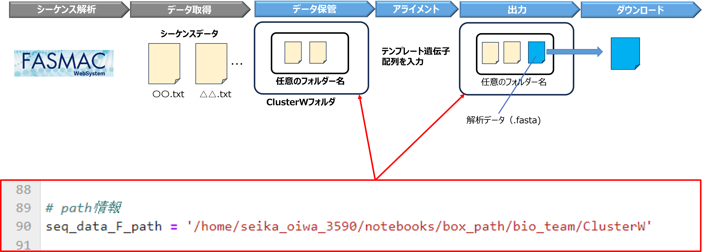

# ClustalO
シーケンスデータのアラインメントツール

# 1. 概要

シーケンス結果（.txt）を基に鋳型となる遺伝子配列にアラインメント（相補配列の向きは自動制御）

API(streamlitで動作)

# 2. 環境構築

(1) モジュールインストール

`conda create -n clustalo python=3.8`

`conda activate clustalo`

`conda install biopython`

`conda install bioconda::clustalo`

(2) gitから解析フォルダダウンロード

`git clone https://github.com/SeikaOiwa/biotools2.git`

# 3. コード修正

シーケンスデータフォルダの保管フォルダのパスを修正

