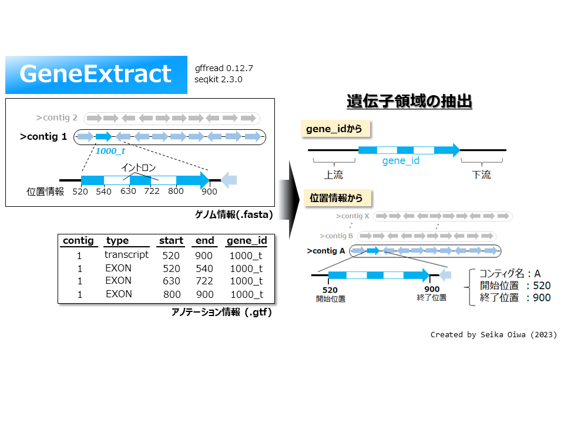
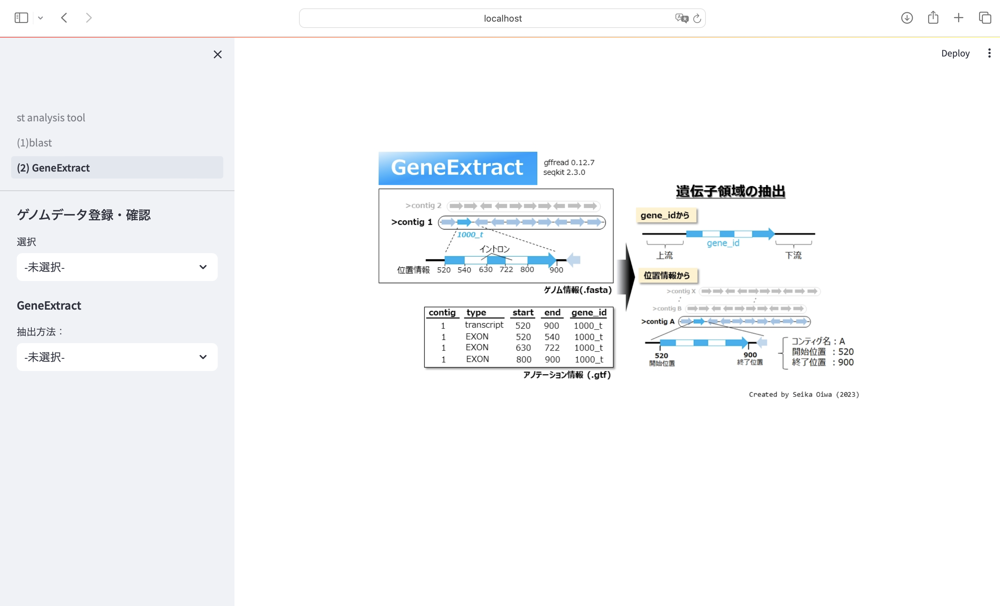

# GeneExtract

# 1. 概要

ゲノムデータ情報(.fasta)もしくはアノテーションデータ(.gtf)から目的の遺伝子配列情報を抽出する

抽出方法は遺伝子番号、位置情報

# 2. 使用方法

streamlitを起動すると下図の画面が立ち上がる

(1) ゲノムデータ登録・確認（初回のみ）

   - サイドバーの`ゲノムデータ登録・確認`から、`ゲノム情報登録`を選択

   - 保存ファイル名を入力し、`フォルダ作成`を押す

   - 生成したフォルダ内に`ゲノム情報(.fasta)`と`アノテーションデータ(.gtf)`を格納し、`データセット`を押す

   - `遺伝子リスト構築`を押し、ゲノム情報の登録を行う

(2) GeneExtract (遺伝子番号)

   - サイドバーの`GeneExtract`から、`gene_idから抽出`を選択

   - 該当する遺伝子番号を入力

   - 抽出範囲（遺伝子の上流・下流領域）を入力　＊遺伝子領域のみを抽出する場合は、上流・下流を`0`とする

   - 抽出方法に応じたボタン`塩基配列(イントロン含む)`or`塩基配列(イントロン含まない)`or `アミノ酸配列`を押す

(3) GeneExtract（位置情報）

   - サイドバーの`GeneExtract`から、`位置情報から抽出`を選択

   - プルダウンから`コンティグ名(染色体番号)`を選択

   - 選択したコンティグにおける位置情報`開始位置`と`終了位置`を入力

   - `開始ボタン`を押し、入力した範囲の遺伝子領域を抽出

(4) GeneExtract（プロモーター・末端領域抽出）

   - サイドバーの`GeneExtract`から、`プロモーター・末端領域抽出`を選択

   - 抽出対象となる`ゲノムデータ`を選択

   - 開始コドンおよび終始コドンの上流および下流を対象とした、抽出範囲を入力

   - (特定遺伝子の場合) 遺伝子番号を入力し、`開始ボタン`を押す

   - (全遺伝子を対象とする場合) `開始ボタン`を押す
