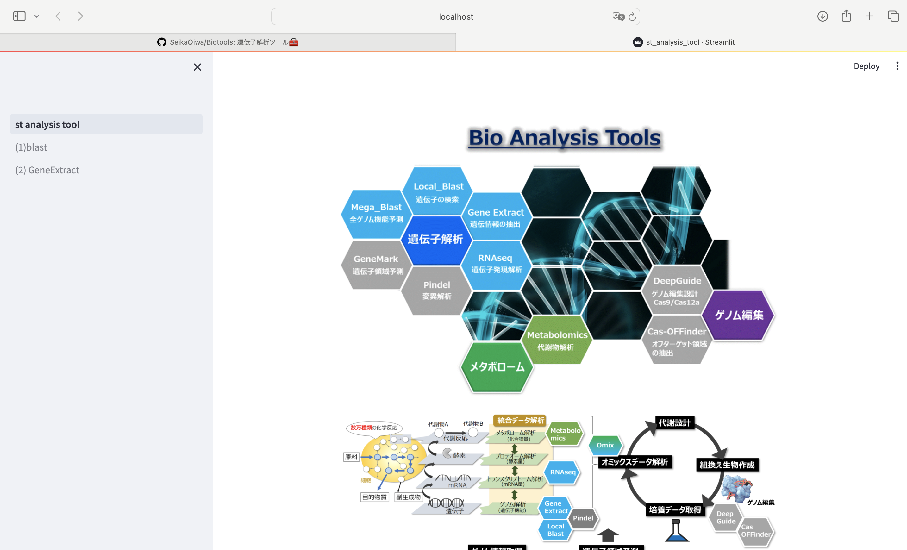

# Biotools
遺伝子解析ツール🧰

# 1. 概要

標準的な遺伝子解析ツールをstreamlitを用いてwebアプリ化

# 2. コンテンツ

(1) Local_blast

   blast検索実行ツール

(2) GeneExtract

   ゲノムデータから、遺伝子番号や染色体位置情報に該当する配列を抽出するツール

(3) RNAseq

   RNAseqデータ解析ツール

(4) GeneAnnotation

   遺伝子領域の予測

# 3. 環境構築

(1) モジュールインストール

`conda create -n biotools python=3.8`

`conda activate biotools`

`conda install biopython`

`conda install -c bioconda blast`

`conda install numpy`

`conda install conda-forge::matplotlib`

`conda install -c bioconda -y fastp`

`conda install -c bioconda hisat2`

`conda install -c bioconda samtools`

`conda install -c bioconda subread`

`conda install -c bioconda -y seqkit`

`conda install bioconda::gffread`

`conda install -c anaconda perl`

`conda install -c bioconda perl-app-cpanminus`

`conda install -c bioconda perl-file-spec`

`conda install -c bioconda perl-hash-merge`

`conda install -c bioconda perl-list-util`

`conda install -c bioconda perl-module-load-conditional`

`conda install -c bioconda perl-posix`

`conda install -c bioconda perl-file-homedir`

`conda install -c bioconda perl-parallel-forkmanager`

`conda install -c bioconda perl-scalar-util-numeric`

`conda install -c bioconda perl-yaml`

`conda install -c bioconda perl-class-data-inheritable`

`conda install -c bioconda perl-exception-class`

`conda install -c bioconda perl-test-pod`

`conda install -c bioconda perl-mce`

`conda install -c bioconda perl-threaded`

`conda install -c bioconda perl-list-util`

`conda install -c bioconda perl-math-utils`

`conda install -c bioconda cdbtools`

`conda install -c bioconda perl-data-dumper`

`conda install -c eumetsat perl-yaml-xs`

`conda install bioconda::clustalo`

`pip install Pillow`

`pip install openpyxl`

`pip install streamlit`

(2) gitから解析フォルダダウンロード

`git clone https://github.com/SeikaOiwa/biotools2.git`

(3) GeneAnnotation
   関連モジュールのインストールが必要となる為、GeneAnnotation/ReadMeを参照

# 4. 起動方法

(1) git cloneでダウンロードした`Biotools`(フォルダ)に移動

`cd /**/**/Biotools`

(2) conda環境に入り、streamlitを動かす

`conda activate biotools`

`streamlit run st_analysis_tool.py`

(3) ローカルホスト上に下図のwebアプリが表示される。

# 注意！　samtoolsエラー対応

以下のエラーが出る場合は、fileフォルダ内のlibcrypto.1.0.0.dylibをenv/biotools/lib/に格納

　　--- error message --- 　　samtools error（Library not loaded: @rpath/libcrypto.1.0.0.dylib）