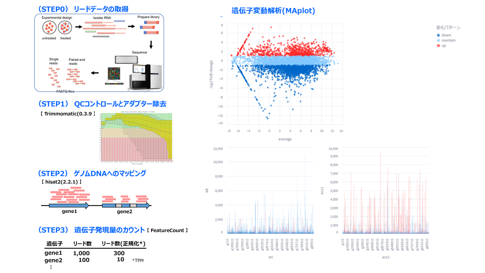
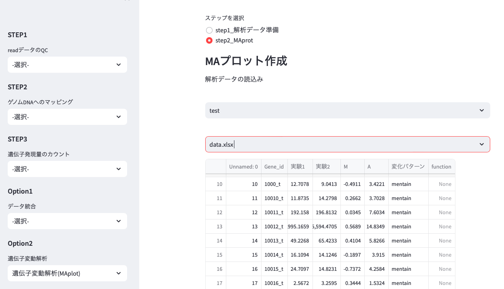

# Biotools
遺伝子解析ツール🧰

# 1. 概要

標準的な遺伝子解析ツールをstreamlitを用いてwebアプリ化

RNAseqデータの処理に関するプログラムを提供

# 2. 環境構築

(1) モジュールインストール

`conda create -n biotools python`

`conda activate biotools`

`conda install biopython`

`conda install numpy`

`conda install conda-forge::matplotlib`

`conda install -c bioconda -y fastp`

`conda install -c bioconda hisat2`

`conda install -c bioconda samtools`

`conda install -c bioconda subread`

`conda install bioconda::gffread`

`pip install Pillow`

`pip install openpyxl`

`pip install streamlit`

(2) gitから解析フォルダダウンロード

`git clone https://github.com/SeikaOiwa/Biotools.git`

# 注意！　samtoolsエラー対応

以下のエラーが出る場合は、fileフォルダ内のlibcrypto.1.0.0.dylibをenv/biotools/lib/に格納

　　--- error message --- 　　samtools error（Library not loaded: @rpath/libcrypto.1.0.0.dylib）

# 3. 起動方法

(1) git cloneでダウンロードした`Biotools`(フォルダ)に移動

`cd /**/**/Biotools`

(2) conda環境に入り、streamlitを動かす

`conda activate biotools`

`streamlit run st_analysis_tool.py`

(3) ローカルホスト上に下図のwebアプリが表示される。

# 4. 使用方法

(1) readデータのQC

外部委託先の解析オプションで、アダプター除去およびQCを選択した場合は、本ステップは不要

- サイドバーのSTEP1 readデータのQCからトリミングを選択
- Biotoolsフォルダ内にRNAseqデータ（`*.fastq.gz`）を保存
- データ選択から対象となるreadデータ２種類を選択 ※表示されない場合は画面を再読込みさせる
- 必要に応じて品質管理値、保持するリードの最小値(mer)を設定
- トリミング開始ボタンを押下
- 完了すると`Triming`フォルダが生成、その中に`trim_r1.fastq.gz`及び`trim_r2.fastq.gz`が保存（マッピングにはこちらを使用）

(2) ゲノムDNAへのマッピング

- サイドバーのSTEP2 ゲノムDNAへのマッピングから、マッピングモードを選択
    - `pair-endモード`:RNAseqをペアエンドで実施した場合
        - マッピングする`ゲノムデータ`及び`RNAseqデータ`を選択
        - 出力するファイル名を入力（例：`明条件` -> 出力ファイル名：`明条件.bam`
    - `multi_pair_endモード`:RNAseqデータが複数ある場合（pair-endのみ）
        - `Biotools`フォルダ下の`Mapping`フォルダを開く
        - 自身で子フォルダを作成し、`RNAseqデータ(*.fastq.gz)`を2種類保管
        - 子フォルダ名＝`出力ファイル名`となる
        - マッピングする`ゲノムデータ`を選択
- `マッピング`を押すと解析開始

(3) 遺伝子発現領のカウント

- サイドバーのSTEP3 遺伝子発現量のカウントを選択
- `Biotools`フォルダ下にマッピングデータ`*.bam`及びゲノムDNAのアノテーションデータ`*.gtf`を保管
    - gffファイルが手元にある場合は、`Option3 GFF->GTF`でgtfファイルに変換する
- メイン画面にて`マッピングデータ`と`アノテーションデータ`を選択
- `アノテーションデータ`を確認（テキストで開ける）、`カウント対象(transcript or exon or CDS)`及び`遺伝子番号の表記(transcript_id or gene_id)`を選択
    - 良く分からない場合は、デフォルトで実施してみる（エラーが出る場合は組合せを変えて再実行）
- 出力ファイル名を入力
- `開始ボタン`で解析開始

- `Raw_Count_data`: 正規化前のデータ、`_RPK`：RPK正規化データ、`_TPM`:TPM正規化データ

(4) データ統合

`遺伝子番号`をキーワードとして２種類のカウントデータ`*.xlsx`や、カウントデータと機能予測データ`*.xlsx`をマージする

- サイドバーのOption `データ統合`を選択
- カウントデータ`*.xlsx`及びマージするデータ`.xlsx`をアップロード
- 出力ファイル名を入力
- 2種類のファイルの列名がヘッダーに来るように位置を調整
- `データ統合`ボタンを押すと、データ統合開始、完了すると結果の概要と`Download`ボタンが表示

(5) 遺伝子変動解析（MAplot）

- Option2 遺伝子変動解析（MAplot）を選択
- メインページの`step1_解析データ準備`を選択
- 保存フォルダ名を入力し、`新規フォルダ作成`ボタンを押す
    - 過去に作成したフォルダにMA解析データを追加する場合は、本ステップは省略可能
- MAデータ保存フォルダを選択
- データ保存名を入力
- データ作成モードの選択（`MA計算`、`MA計算＋遺伝子機能情報`）
    - MA計算：２種類のCountデータが必要
    - MA計算＋遺伝子機能情報：Countデータに加え、遺伝子番号+機能予測を含むリストデータ（*.xlsx）が必要
- データをアップロード
    - Countデータは、遺伝子番号と正規化前のカウントデータが含むこと（他の情報が含まれても問題ない）
- `実験名`を入力する
- `遺伝子番号`および`カウント`の列名が表示されるように`-/+`ボタンを押して調整
- `実行ボタン`を押すと解析開始、終わるとMA計算結果（*.xlsx）がフォルダ内に生成
- 結果の確認
    - メインページ上の`step2_MAplot`を選択
    - 参照するMA計算データを`フォルダ`、`ファイル名`の順番に選択
    - メインページ下部にMAplotデータが表示

