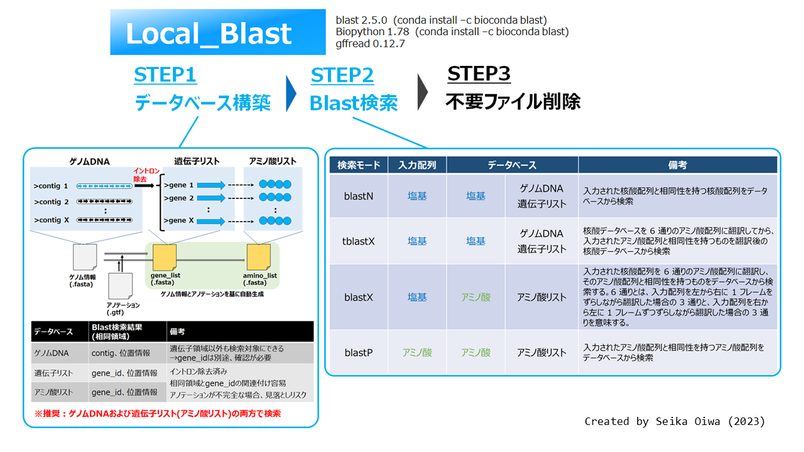
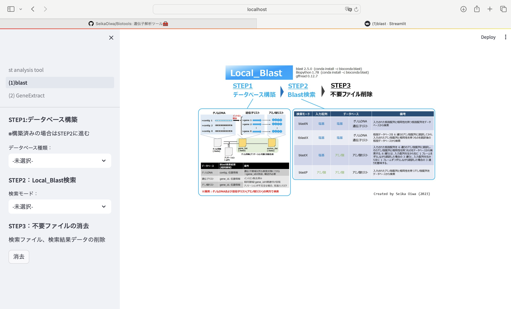

# Local_blast

# 1. 概要

ローカル環境でのblast検索実行ツール

blastN、blastP、blastX、tblastXに対応

# 2. 使用方法

streamlitを起動すると下図の画面が立ち上がる

(1) 検索用データベースを構築（初回のみ）

   ・サイドバーの`STEP1 データベース構築`から、データベースタイプを選択

   ・菌株名（データ保存名）を入力

   ・`Gfileフォルダ`に`ゲノムデータ(.fasata)`および`アノテーションデータ(.gtf)`を格納

   ・`Goボタン`を押し、データベース構築開始 

   ＊同じ菌株名で登録すると、`ゲノムDNA`と`遺伝子リスト`のように複数のデータベースを保持させることも可能

(2) (option) 機能予測データや、RNAseqデータの登録
   仕様：.xlsxのみ、列名に`gene_id`を持ち、.gtfファイルと同じ遺伝子番号が振られていること

   ・サイドバーの`STEP1 データベース構築`から、`Option_アノテーション`を選択

   ・該当する菌株名を選択

   ・ファイル保存名を入力（一つの菌株に対し、複数の情報を保存可能）

   ・excelファイルをアップロード

   ・`gene_id`が１行目になるようにヘッダー位置を調整

   ・`セット`を押し、情報を登録

(3) Local_Blast検索

   ・サイドバーの`STEP2 Local_Blast検索`から、`検索モード`を選択

   ・検索配列の登録を行う
    
   - `出力ファイル名（特に意味なし）`を入力

   - `検索配列（fasta形式）`を入力(複数可)

    > gene1

      atgctt・・・
    
    > gene2

      atctct・・・

   - `アップロード`ボタンを押す

   ・データベースおよびデータベース種類を選択

   ・パラメーター（e-valueのみ）を設定

   ・（option）blast検索結果に機能名やRNAseqデータを付加したい場合は`使用`を選択

   ・`実行`ボタンで検索開始
